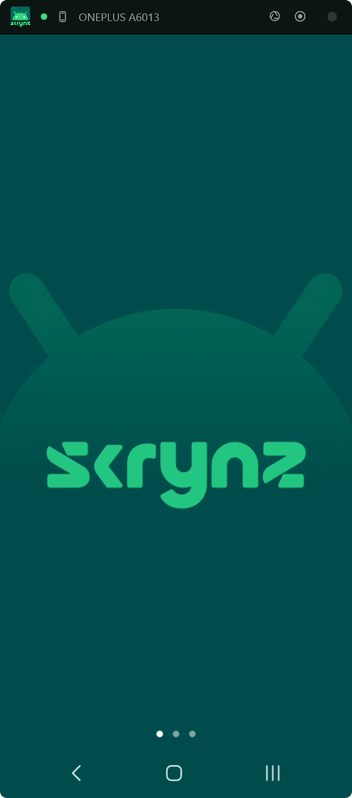
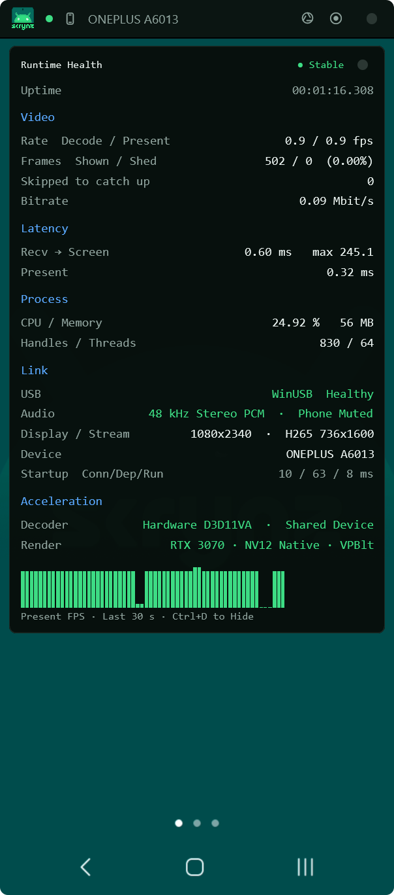
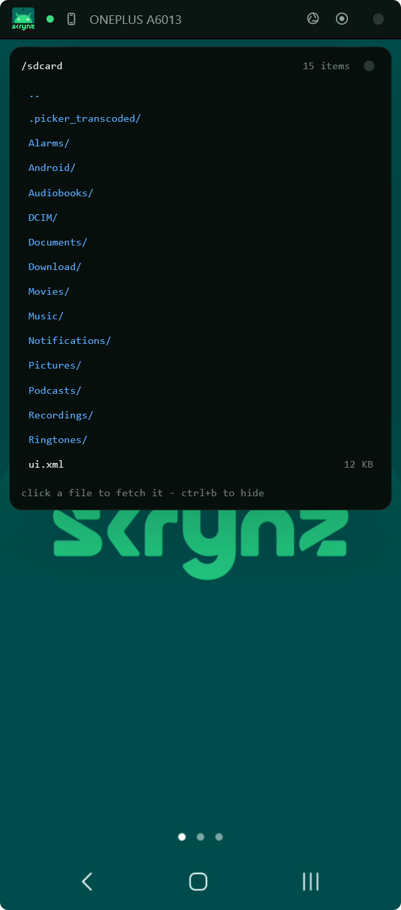

<div align="center">


### Android screen mirroring and control for Windows, in a single 9.2 MB file.

**Download one file. Plug in the phone. That is the whole setup.**

[](LICENSE)


[**Download**](https://github.com/zncodex/skrynz/releases) ·
[Features](#features) ·
[Quick start](#quick-start) ·
[Shortcuts](#keyboard-and-mouse-shortcuts) ·
[Automation](#automation-api) ·
[vs scrcpy](#skrynz-vs-scrcpy) ·
[FAQ](#faq)

<br>


&nbsp;&nbsp;

&nbsp;&nbsp;


</div>


**skrynz** puts your Android phone on the Windows desktop and hands you the mouse and keyboard. Over USB or Wi-Fi, at 60 fps, decoded on the GPU. It records to MP4, takes screenshots at the phone's own resolution, moves files both ways, shares the clipboard, plays the phone's audio through your speakers, and can open a single Android app as an ordinary Windows window.

All of it ships as **one executable**. skrynz implements the ADB protocol itself over WinUSB, links FFmpeg statically, and carries its device agent inside the binary, so there is nothing to install on either machine.

A **scrcpy alternative for Windows** that is a single portable file and never asks you for platform-tools.

## Contents

- [One file, and only one](#one-file-and-only-one)
- [Features](#features)
- [Quick start](#quick-start)
- [Keyboard and mouse shortcuts](#keyboard-and-mouse-shortcuts)
- [Command line](#command-line)
- [Automation API](#automation-api)
- [How it works](#how-it-works)
- [Security and privacy](#security-and-privacy)
- [Requirements](#requirements)
- [skrynz vs scrcpy](#skrynz-vs-scrcpy)
- [Troubleshooting](#troubleshooting)
- [FAQ](#faq)
- [License](#license)

## One file, and only one

Download `skrynz.exe`, double-click it, and your phone is on screen. It installs nothing, extracts nothing, and writes nothing beside itself.

```
phone  ›  HEVC hardware encode  ›  USB / Wi-Fi  ›  libavcodec + D3D11VA  ›  GPU  ›  window
```

|  |  |
|---|---|
| **It speaks ADB itself** | The protocol is implemented in the binary, over WinUSB. Nothing to download, nothing to keep on `PATH`, and no daemon left running behind you. |
| **The device agent ships inside it** | The phone half lives in the exe, runs from `/data/local/tmp`, and leaves when the session does. Your phone never sees an APK. |
| **Everything is linked in** | FFmpeg and the C runtime are static. It runs on a Windows install that has never met a redistributable or a codec pack. |
| **Your phone is the only endpoint** | The one connection skrynz opens goes to your device. There is no account, no update check, and nothing to opt out of. |
| **It verifies itself** | The binary carries a SHA-256 of its own image and refuses to start if a single byte has changed. |

## Features

|  |  |
|---|---|
| **Mirroring** | 60 fps H.265 (HEVC) with H.264 fallback, decoded by libavcodec through D3D11VA. Frames stay on the GPU from decode to present, with no per-frame readback. |
| **Control** | Mouse, keyboard, scroll. Right-click for Back, middle-click for Home. `Ctrl + drag` adds a second finger for pinch and rotate. Typed text is sent as text, so accented and non-Latin characters arrive as themselves. |
| **Audio** | The phone's own output plays on the PC over WASAPI, as raw PCM through the same connection. The phone itself stays silent while it does. |
| **Recording** | MP4, remuxed byte for byte from the device stream. Recording reaches **30 seconds into the past**: the last 30 seconds are always held, so pressing Record captures what already happened. |
| **Screenshots** | Taken on the phone, at the panel's own resolution, not a scaled copy of the window. |
| **Apps as windows** | An app can open onto a display of its own and sit on the desktop as a Windows window, beside your Windows programs. A desktop shortcut can launch straight into one app. |
| **Files** | Browse the phone and click to fetch. Drop a file on the window to send it: an APK is installed, anything else lands in Downloads. |
| **Clipboard** | Both directions, one shortcut each, and the phone's clipboard is re-read whenever the window comes forward. |
| **Several phones** | Switch between them instantly, or drive all of them with the same input at once. |
| **Wireless** | Switch a plugged-in phone to Wi-Fi from the about card, then unplug it and open it with `skrynz <ip>:5555` from then on. |
| **Rotate and resize** | Turn the phone from the PC, or ask it for a different mirroring resolution, without touching it. |
| **Input record and replay** | Record what you do to a file and play it back. A macro recorder for the phone, driven from a script. |
| **Automation API** | A local named pipe takes one line and answers one: capture, record, tap, type, rotate, resize, status. |
| **Health overlay** | Frame rate, latency, decode path, dropped frames, CPU, memory, handles and threads, live. |
| **Tray** | Minimises to the notification area and comes back with a click. The window position is remembered between runs. |

## Quick start

1. On the phone: **Settings › About phone → tap Build number seven times**, then turn on **Developer options › USB debugging**.
2. Plug it in and accept **Allow USB debugging** when it appears.
3. Run `skrynz.exe`.

Nothing to install. Nothing to configure. If more than one phone is attached, a picker opens rather than a guess.

> **First run:** the binary is not yet code-signed, so Windows SmartScreen may show *“Windows protected your PC”*. Click **More info → Run anyway**. Some antivirus may also flag an unsigned, self-verifying binary; allow it if it does.

## Keyboard and mouse shortcuts

| Key | Action |
|---|---|
| `Ctrl+P` | Device picker |
| `Ctrl+A` | Apps, each in a window of its own |
| `Ctrl+B` | Browse the phone's files |
| `Ctrl+C` | Phone clipboard to PC |
| `Ctrl+V` | PC clipboard to phone |
| `Ctrl+M` | Send input to every open phone |
| `Ctrl+D` | Runtime health overlay |
| `Ctrl+I` | Session info, the wireless switch, and every control on one card |
| Right-click | Back |
| Middle-click | Home |
| `Ctrl + drag` | Second finger, for pinch and rotate |
| Double-click header | Fit the window to the phone's shape |
| Drop a file | Send it to the phone |

`Esc`, `Tab`, `Enter`, `Backspace`, `Delete`, the arrow keys, `Home`, `End`, `PgUp` and `PgDn` reach the phone as key events. Everything else you type is sent as text.

## Command line

```powershell
skrynz.exe                                  # the only phone attached
skrynz.exe 5FDEC918                         # that phone, by serial
skrynz.exe 192.168.1.42:5555                # that phone, over the network
skrynz.exe --app com.whatsapp               # that app, in a window of its own
skrynz.exe 5FDEC918 --app com.spotify.music # both
```

`--app` is what makes a desktop shortcut possible: one icon on the Windows desktop that opens one Android app, with no phone screen in between.

## Automation API

Every window opens a local named pipe, `\\.\pipe\skrynz-<serial>-<hash>`. One line in, one line out. Enough for the things people actually automate: a Stream Deck key that starts a recording, an OBS script that grabs a screenshot at the right moment, a test runner that taps its way through an app.

It is a **pipe rather than a socket** by design. A named pipe is not reachable from another machine, so the no-network promise holds by construction rather than by policy.

The name carries the device serial so that two phones never collide, plus a short hash so that an unusual serial cannot escape the name. Do not spell it out: list the pipes and match the `skrynz-` prefix.

```powershell
$name = [System.IO.Directory]::GetFiles('\\.\pipe\') |
        ForEach-Object { Split-Path $_ -Leaf } |
        Where-Object   { $_ -like 'skrynz-*' } | Select-Object -First 1

$pipe = New-Object System.IO.Pipes.NamedPipeClientStream '.', $name, 'InOut'
$pipe.Connect(5000)
$pipe.ReadMode = 'Message'

function skrynz($cmd) {
    $out = [Text.Encoding]::UTF8.GetBytes("$cmd`n")
    $pipe.Write($out, 0, $out.Length); $pipe.Flush()
    $in = New-Object byte[] 4096
    $n  = $pipe.Read($in, 0, $in.Length)
    [Text.Encoding]::UTF8.GetString($in, 0, $n)
}

skrynz 'record start'   # ok
skrynz 'tap 0.5 0.8'    # ok
skrynz 'status'         # connected=true frames=1841 fps=59.9 recording=true device=SM-S908E
```

The pipe is a **message** pipe, so read one message per command rather than scanning for a newline. A window opened with `--app` puts the package in the name too, as `skrynz-<serial>-<package>-<hash>`, so each app window can be driven separately.

| Command | Effect |
|---|---|
| `capture [file]` | Screenshot on the phone. With a path, straight to that file; without one, the save dialog. |
| `record start` · `record stop` | Start or stop an MP4 recording, including the 30 seconds before the call. |
| `tap <x> <y>` | Tap, in fractions of the screen (`0..1`), so a script keeps working on the next phone. |
| `key <keycode>` | Any Android keycode. |
| `text <what to type>` | Type a string, Unicode included. |
| `back` · `home` | The two buttons, by name. |
| `rotate 0\|1\|2\|3\|auto` | Turn the phone from the PC. |
| `resize <W>x<H>` · `resize reset` | Ask the device for a different mirroring resolution. |
| `input record <file>` · `input stop` · `input replay <file>` | Record real input to a file and play it back. |
| `broadcast on\|off` | One pair of hands driving every open phone. |
| `wireless` | Move this phone to Wi-Fi. |
| `status` | `connected= frames= fps= recording= device= stream=` |
| `help` | The list, from the binary itself. |

## How it works

```
ADB protocol      spoken directly over WinUSB and TCP, no adb.exe, no server
device agent      launched with app_process, from /data/local/tmp, no APK installed
wire session      one connection: video, audio, control, clipboard, files
decode            libavcodec + D3D11VA, straight into GPU textures
present           DirectComposition, with no readback between decode and screen
audio             WASAPI playback of the device's raw PCM
recording         remuxed to MP4 by mapping rather than reading: flat memory, any length
integrity         the self-seal the binary checks before it will run
```

The device agent lives **inside** the exe. At startup it is pushed to `/data/local/tmp`, launched with `app_process`, and taken down with the session, so nothing is installed on the phone and nothing is left behind. It encodes with MediaCodec on the phone's own hardware encoder, captures audio through `REMOTE_SUBMIX`, and injects input through the framework's own APIs.

On the PC side there is no per-frame trip through system memory: the decoder writes into a D3D11 texture and the compositor presents that texture. The one exception is a screenshot, which is the only thing that actually wants the pixels on the CPU.

## Security and privacy

- **No telemetry, no update check, no account.** The only thing skrynz connects to is your device.
- **Self-sealed binary.** A 48-byte SHA-256 seal is stamped into the image and verified at every start. A patched or infected copy refuses to run.
- **Process hardening.** Once the seal passes: DLL resolution restricted to System32, remote and low-integrity images rejected, legacy extension-point injection disabled, on top of the PE's ASLR, high-entropy VA and DEP/NX.
- **Nothing to load beside it.** Every import in the binary is a Windows system component, so there is no DLL for anything to sit next to and be picked up instead.
- **Local-only control surface.** The automation pipe rejects remote clients and carries the device serial in its name.
- **What it writes to disk:** a four-line window rectangle in `%APPDATA%\skrynz\window.txt`, plus the recordings and screenshots you ask for. Nothing else.

## Requirements

* Windows 10 or 11, x64
* Android 11 or newer, with USB debugging enabled
* A GPU with H.265 or H.264 D3D11VA decode (NVIDIA, Intel or AMD: anything from the last decade)

## skrynz vs scrcpy

scrcpy is excellent, and skrynz is not a fork of it: no shared code, its own ADB client, its own wire protocol, its own device agent, its own UI. The two make different trade-offs.

|  | skrynz | scrcpy |
|---|---|---|
| Platforms | Windows 10/11 only | Windows, macOS, Linux |
| Download | One `.exe`, 9.2 MB | Archive with `adb.exe` and DLLs |
| Needs adb / platform-tools | No, speaks ADB itself over WinUSB | Yes, ships and runs the ADB server |
| Installed on the phone | Nothing | Nothing |
| Window | Native Windows, tray, drag-and-drop | SDL |
| Retro-active recording | Yes, the last 30 s are always held | No |
| An app in its own desktop window | Yes | Virtual displays, per-app since v3 |
| Automation | Named pipe: tap, type, record, replay, resize | Command line and shortcuts |
| License | Apache 2.0 | Apache 2.0 |

Use whichever fits. If you need macOS or Linux, use scrcpy.

## Troubleshooting

**“Device is in use”, or nothing appears.**
Something else is holding the USB interface. Close `adb.exe`, Android Studio, scrcpy or a vendor phone-manager tool. Only one client can claim it. `adb kill-server` does it too.

**Windows SmartScreen blocks it.**
The binary is not yet code-signed. **More info → Run anyway**. You can check what you downloaded against the SHA-256 on the release page.

**No “Allow USB debugging” prompt.**
Unlock the phone, unplug and re-plug, and check the USB mode is not *charging only*. If you once tapped Deny, use **Developer options → Revoke USB debugging authorisations** and try again.

**Mirroring works, but there is no sound.**
Audio comes from `REMOTE_SUBMIX`, which some devices and some apps refuse to hand over. Mirroring continues either way: audio is optional by design.

**It stutters, or the frame rate is low.**
Open `Ctrl+D` and look at the decode path. A laptop that puts the app on its integrated GPU while the display hangs off the discrete one pays for the copy; pin skrynz to the discrete GPU in **Windows Settings → Display → Graphics**.

**The phone rebooted and wireless stopped working.**
Wireless survives an unplug, not a reboot: adbd goes back to USB. Plug in once and switch it over again from `Ctrl+I`.

## FAQ

**Do I need adb, platform-tools or Android Studio?**
No. skrynz implements the ADB protocol itself, over WinUSB. There is nothing to download and no server left running.

**Do I need the Visual C++ Redistributable, FFmpeg, or a codec pack?**
No. All of it is linked statically inside the exe.

**Does anything get installed on the phone?**
No. The agent runs from `/data/local/tmp` and leaves nothing behind.

**Does it need root?**
No.

**Does it phone home?**
No. There is no telemetry and no update check. The only thing skrynz connects to is your device.

**Can I mirror over Wi-Fi?**
Yes. Plug in once, open `Ctrl+I` and choose **Cut the cable**, then unplug. After that, `skrynz.exe 192.168.1.42:5555` goes straight over the network. USB is the better picture; Wi-Fi is the better cable.

**Can I use several phones at once?**
Yes. One window per phone, switched instantly, and `Ctrl+M` sends the same input to all of them.

**Can I automate it?**
Yes, see [Automation API](#automation-api). Taps, typing, screenshots, recording, rotation, resolution, and record-and-replay of real input, over a local named pipe.

**Is this a scrcpy fork?**
No. skrynz is written from scratch in Rust. What it shares with every Android mirroring tool is the `app_process` launch pattern and FFmpeg for decoding.

**Is it portable? Can I run it from a USB stick?**
Yes. It is one file, it needs no installer, and the only thing it leaves behind is a window rectangle in `%APPDATA%`.

## License

`skrynz.exe` is distributed under the **Apache License 2.0**. Copyright 2026 **zncodex**, all rights reserved except those the license grants. The name and logo are not part of that grant.

skrynz is provided **as is, with no warranty of any kind**. zncodex accepts no liability for any damage arising from its use, including loss or corruption of data and damage to any device. Enabling USB debugging and authorising a computer on your device is done at your own risk. See [LICENSE](LICENSE) sections 7 and 8, and [NOTICE](NOTICE).

Third-party: skrynz links **FFmpeg** statically, under **LGPL 2.1+**. Build configuration, upstream source and relink offer are in [NOTICE](NOTICE).

---

<div align="center">

<sub>
android screen mirroring · mirror android to pc · control android from pc · android screen mirror windows 11 · scrcpy alternative windows · screen mirroring without adb · android remote control from computer · display phone screen on pc · record android screen to mp4 · android screen recorder for pc · usb screen mirroring · wireless android mirroring over wifi · mirror phone to laptop · run android apps on windows · portable android mirroring tool · single exe screen mirror · no root android mirroring · phone screen on desktop · android file transfer windows · android clipboard sync pc · android audio to pc · hevc h265 hardware decoding · d3d11va zero copy · winusb adb client · rust windows app
</sub>

<br><br>

<sub>
<b>Topics:</b>
android · android-mirroring · screen-mirroring · scrcpy · scrcpy-alternative · screen-sharing · screen-recorder · remote-control · android-control · adb · winusb · windows · win32 · rust · rust-lang · ffmpeg · libavcodec · d3d11va · directcomposition · hardware-acceleration · hevc · h265 · h264 · wasapi · mediacodec · portable-app · single-binary · no-telemetry · privacy · developer-tools
</sub>

<br><br>

<sub>#android #androidmirroring #screenmirroring #scrcpy #scrcpyalternative #windows #windows11 #win32 #rust #rustlang #ffmpeg #d3d11va #hardwaredecoding #hevc #adb #winusb #screenrecorder #remotecontrol #portableapp #singlebinary #notelemetry #privacy #opensource #apache20</sub>

</div>
